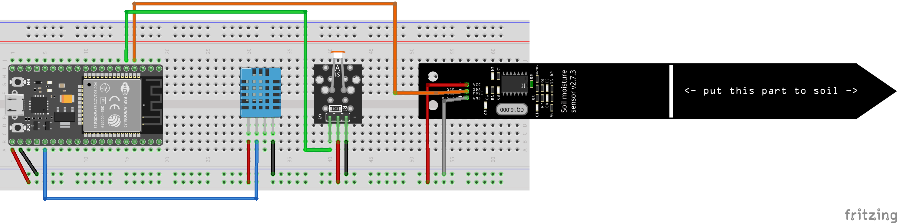
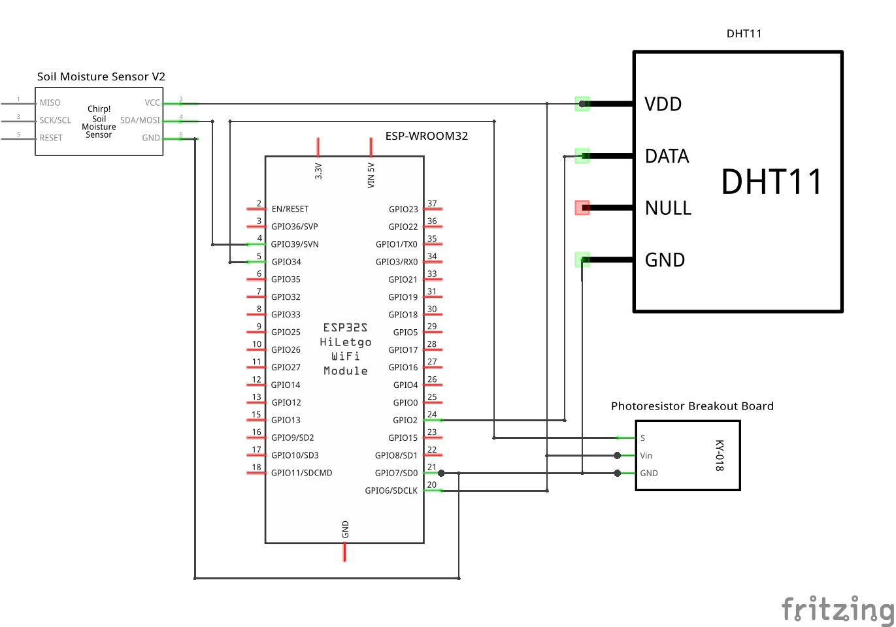
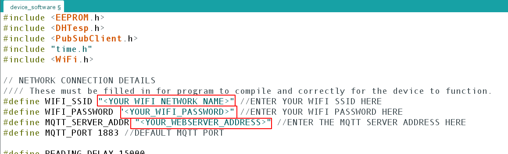
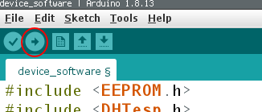
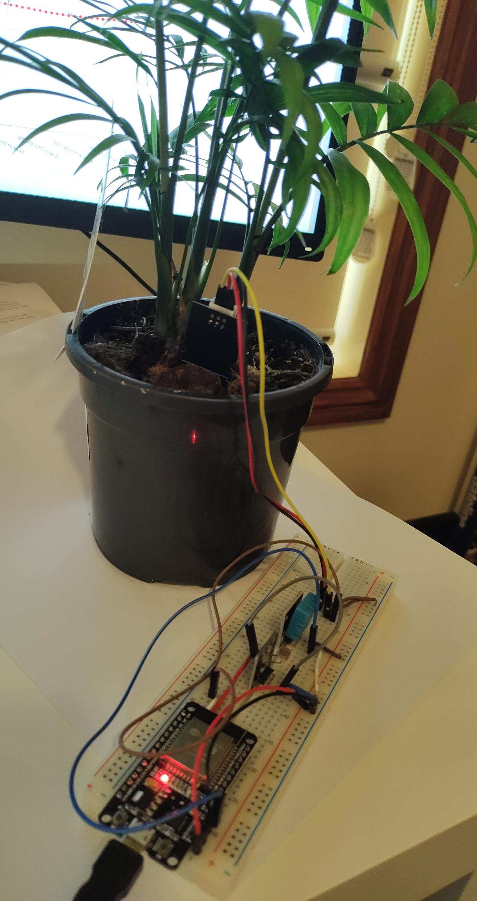

# PlantSpeak_device
Github Repository: https://github.com/PlantSpeak/PlantSpeak_device

This software can be uploaded to an ESP32-WROOM Development board to measure ambient temperature, humidity and light intensity as well as soil moisture, using  DHT11, photoresistor and Soil moisture sensor v1.2 module respectively.

## Device User Guide
### Requirments
#### Hardware
The following components were used to build a prototype. Similar substittutes can be used in some instances although this may cause unexpected behaviour and/or may require code changes/calibration.

- ESP32-WROOM Development Board
- KY-018 Photoresistor breakout board (photoresistor with auxilary circuitry incl. pull-up resistor)
- DHT11 Temperature and Soil Moisture Sensor
- Soil Moisture Sensor V1.2 (Generic)

The components should be arranged per the following diagram and schematic.

#### Software
- Arduino IDE (install using instructions found here: https://www.arduino.cc/en/Guide)
- The following libraries must be installed in the Arduino IDE:
	- DHTesp (https://github.com/beegee-tokyo/DHTesp)
	- arduino-esp32 (https://github.com/espressif/arduino-esp32)
	- Arduino Client for MQTT (https://github.com/knolleary/pubsubclient/)

### Preparation
Intstall the Arduino IDE.

Install the libraries listed to the IDE using the following guides:
https://www.arduino.cc/en/guide/cores for arduino-esp32
https://www.arduino.cc/en/guide/libraries for the other libraries

### Configuration
Open the file 'PlantSpeak_device/device_software/device_software.ino' in the Arduino IDE.

Set the wifi network, wifi password, MQTT Server (the IP or web address of the server on which the webapp is running) in the editor.

Connect device to your computer via a USB to micro-USB cable and ensure red light is on.

Compile and flash to device by pressing the arrow button (highlighted below).

The device should now be sending pairing requests to the webapp so that it can be added to the system.

### Set up in plant
Place the soil moisture monitor in the plant as per the image.

